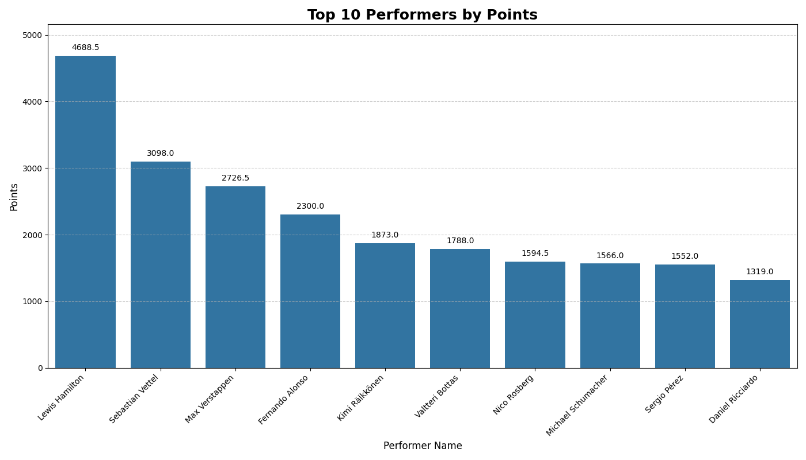
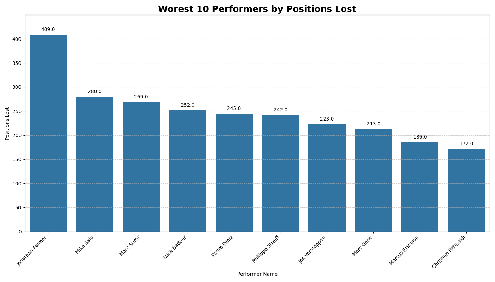

# Report:
* Based on performed data analysis on the results.csv file combined with names of teams and drivers.

## Top Performers:

* The top 10 drivers based on the highest points aquired are:
  * Lewis Hamilton
  * Sebastian Vettel
  * Max Verstappen
  * Fernando Alonso
  * Kimi Räikkönen
  * Valtteri Bottas
  * Nico Rosberg
  * Michael Schumacher
  * Sergio Pérez
  * Daniel Ricciardo

## Teams Efficiency:

* The top 10 teams based on the highest points aquired are:
  * Mercedes
  * Red Bull
  * Brawn
  * Lotus F1
  * Ferrari "scored the highest points in all time"
  * *Racing Point
  * McLaren
  * Matra-Ford
  * Alpine F1 Team
  * Aston Martin

## Reliability Analysis:

* This graph show the seasons/years with the most DNFs with the 5 most common reasons.
* The most common reason for DNF was the diqualification of drivers over the years and also there was a noticable problem with accidents which show the insufficient training of drivers, making training the biggest concerns.
* Other reasons should still be considered but they have less occurance rate than the these two reason which needs to be addressed first.

## Worset Performers:

* The worest 10 drivers that lost the most positions are:
  * Jonathan Palmer "lost the most positions"
  * Mika Salo
  * Marc Surer
  * Luca Badoe
  * Pedro Diniz
  * Philippe Streiff
  * Jos Verstappen
  * Marc Gené
  * Marcus Ericsson
  * Christian Fittipaldi